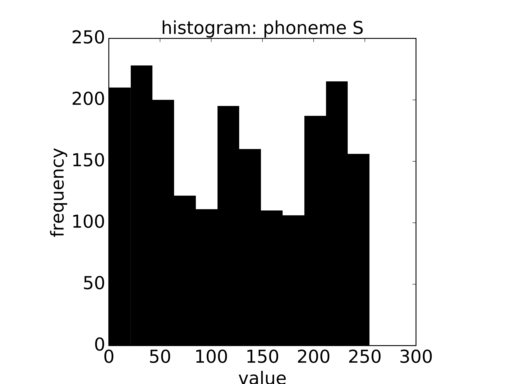
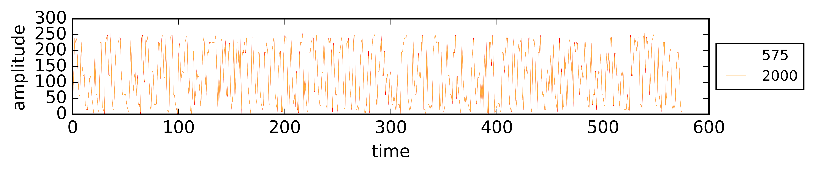
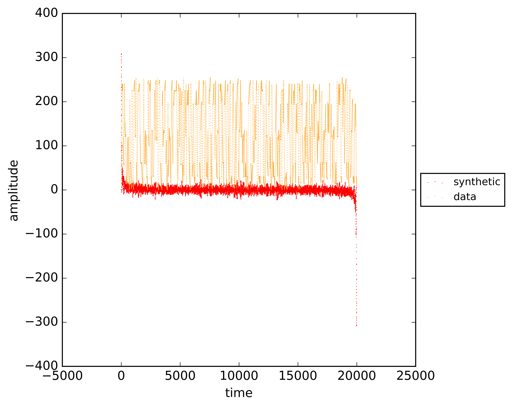

# deep throat

# credits

- name by Liam Moore

# introduction

Deep throat is a Python program that can synthesize speech. A simple approach to unrestricted text-to-speech translation uses a small set of letter-to-sound rules, each rule specifying a pronunciation for one or more letters in some context. Deep throat features a small set of letter-to-sound rules that translate English text to phonemes producing usably accurate pronunciations of words. Deep throat can produce sounds by combining stored representations of phoneme sounds in accordance with generated phoneme translations. It can output these sounds to computer sound hardware using PortAudio and it can save them to sound file.

Deep throat can accept text as a command line option argument, from a pipe and it can be set into an interactive mode.

Deep throat can be set to read the date and time in various ways, such as in a loop. It can translate text to phonemes, it can translate specified phonemes to sounds and it can translate numbers to English text. It can engage visual and sound analyses.

# setup

```Bash
sudo apt-get -y install libasound-dev
sudo apt-get -y install portaudio
sudo apt-get install python-pyaudio
sudo apt-get install python3-pyaudio
sudo pip install deep_throat
sudo python -m nltk.downloader all
```

# phonemes

There are data for 36 phonemes defined in deep throat:

|**phonemes**|
|------------|
|space       |
|A           |
|B           |
|D           |
|F           |
|G           |
|H           |
|J           |
|K           |
|L           |
|M           |
|N           |
|P           |
|R           |
|S           |
|T           |
|U           |
|V           |
|W           |
|Y           |
|Z           |
|AE          |
|AH          |
|AW          |
|CH          |
|EE          |
|EH          |
|IH          |
|OH          |
|OO          |
|SH          |
|TZ          |
|TH          |
|UH          |
|WH          |
|ZH          |

# letter-to-sound rules

Deep throat letter-to-sound rules rules are defined in strings in a form easy for humans to read and write. Rules have the form `A/B/C/D`: the character string occurring with left context `A` and right context `C` gets the pronunciation `D`. Some simple example rules are as follows:

```
ARE/ / /AH-R
FIRST/ //F-U-R-S-T
COMPUTER/ //K-AH-M-P-Y-OO-T-OH-R
SHITFACED/ //S-H-IH-T-F-A-S-D"
```

# usage examples

|**command**                                                                |**comment**                    |
|---------------------------------------------------------------------------|-------------------------------|
|`deep_throat.py --help`                                                    |help with options and arguments|
|`deep_throat.py --text="hello world"`                                      |speak specified text           |
|`deep_throat.py --timeloop`                                                |speak time in a loop           |
|`deep_throat.py --infile="text.txt"`                                       |speak input text file          |
|`deep_throat.py --text="hello world" --savetowavefile --outfile="test.wav"`|save text to WAVE file         |
|`echo "test" | deep_throat.py`                                             |speak pipe text                |
|`deep_throat.py --interactive`                                             |engage interactive mode        |
|`deep_throat.py --analysisvisual`                                          |engage visual analysis mode    |
|`deep_throat.py --analysissound`                                           |engage sound analysis mode     |

# visual and sound analyses

The visual analysis mode saves histograms of all of the phonemes, saves multigraph comparisons of phonemes of different resolutions and saves graph comparisons of phonemes data and fast Fourier transform synthesized phonemes data. The sound analysis mode speaks the 50 most frequent Brown Corpus words.







# future

Under consideration is improvement of rules interpretations, phonemes data of higher resolution, improvements in efficiency, and system checks (such as PortAudio checks).

# references

- H. S. Elovitz, R. W. Johnson, A. McHugh and J. E. Shore, Automatic Translation of English Text to Phonetics by Means of Letter-to-Sound Rules, Naval Research Laboratory Report 7948 (21 January 1976)
- H. S. Elovitz, R. Johnson, A. McHugh and J. Shore, Letter-to-Sound Rules for Automatic Translation of English Text to Phonetics, IEEE Transactions on Acoustics, Speech, and Signal Processing, Volume. ASSP-24, Number 6 (December 1976)
